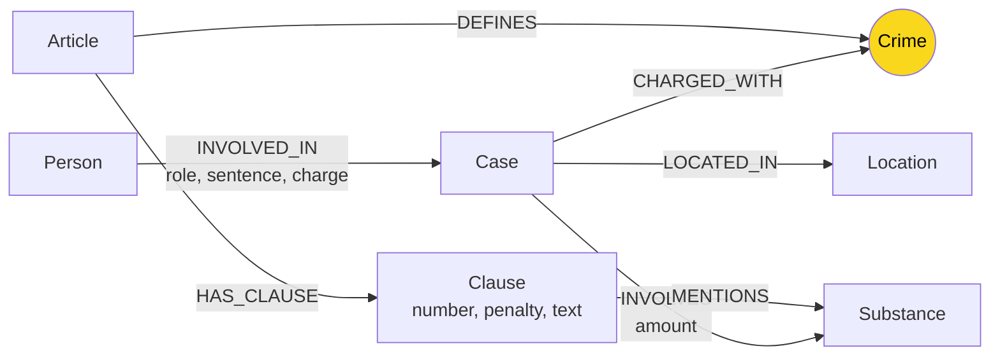

# Lab Guide — Day 19 Knowledge Graph

Làm **đúng thứ tự**. Mỗi bước có **lệnh kiểm tra** và **dấu hiệu xong**. Chưa đạt dấu hiệu xong thì chưa sang bước sau. Gặp lỗi thì xem [Xử lý lỗi](#xử-lý-lỗi) ở cuối file.

| Bước | Việc | Thời gian |
| --- | --- | --- |
| 0 | Setup môi trường + Neo4j | 20' |
| 1 | Đọc dữ liệu và câu hỏi | 15' |
| 2 | **Thiết kế ontology** → `report/ONTOLOGY.md` | 40' |
| 3 | KG-1 `link_entity` | 15' |
| 4 | KG-2 `build_graph` + nạp graph vào Neo4j | 50' |
| 5 | KG-3 `Neo4jGraph.context` (Cypher multi-hop) | 45' |
| 6 | KG-4 `GraphRAGAgent.answer` | 15' |
| 7 | Chạy benchmark | 10' |
| 8 | Xem graph, chụp ảnh, tìm lỗi | 50' |
| 9 | Viết báo cáo, nộp bài | 40' |

> **Hai con đường.** Trong `src/graph.py` có sẵn một **ontology gợi ý** (các phần đánh dấu `HINT`) kèm hàm trích xuất và ghi vào Neo4j.
> - **Dùng gợi ý:** gọi lại các hàm HINT trong TODO. Đủ điểm chuẩn.
> - **Tự thiết kế:** ontology của riêng bạn, khác gợi ý một cách có chủ đích → **bonus +15** (SUBMISSION.md).
>
> Dù đi đường nào cũng **phải nộp `report/ONTOLOGY.md`**: thiết kế là phần quan trọng nhất của một Knowledge Graph.

---

## Bước 0 — Setup

**Cần có:** Python 3.11, Docker Desktop (đang chạy), và ít nhất một API key: OpenAI (khuyên dùng), OpenRouter, Gemini hoặc Anthropic. Anthropic chỉ dùng cho chat; embedding cần OpenAI/OpenRouter/Gemini.

> **Bật Docker Desktop trước** mỗi khi chạy lệnh `docker run` / `docker start neo4j-drug-kg` (kể cả mỗi lần mở lại máy). Đợi biểu tượng Docker chuyển xanh rồi mới chạy. Nếu chưa bật, lệnh báo `cannot connect to the Docker daemon`.

```bash
# 1. Môi trường Python
py -3.11 -m venv .venv            # macOS/Linux: python3.11 -m venv .venv
.venv\Scripts\activate             # macOS/Linux: source .venv/bin/activate
pip install -r requirements.txt

# 2. Neo4j. Chỉ chạy lệnh này lần đầu; các lần sau dùng: docker start neo4j-drug-kg
docker run -d --name neo4j-drug-kg -p 7474:7474 -p 7687:7687 -e NEO4J_AUTH=neo4j/password123 neo4j:5

# 3. API key
copy .env.example .env             # macOS/Linux: cp .env.example .env
#    mở .env, điền ít nhất một key; xem bảng provider bên dưới
```

### Chọn provider

Provider chính và rẻ nhất cho baseline là **OpenAI**. OpenRouter, Gemini và Anthropic là phương án dự phòng. `bench_kg.py` in provider thực tế ở đầu mỗi lần chạy để số liệu benchmark không bị lẫn.

| Provider chat | Key trong `.env` | Model mặc định | Embedding dùng |
| --- | --- | --- | --- |
| **OpenAI (chính)** | `OPENAI_API_KEY` | `gpt-4o-mini` | OpenAI `text-embedding-3-small` |
| OpenRouter | `OPENROUTER_API_KEY` | `openai/gpt-4o-mini` | OpenRouter `openai/text-embedding-3-small` |
| Gemini | `GEMINI_API_KEY` | `gemini-3.6-flash` | Gemini `gemini-embedding-001` |
| Anthropic | `ANTHROPIC_API_KEY` | `claude-opus-5-5` | **Không có embedding API**: phải thêm key OpenAI/OpenRouter/Gemini |

Nếu có nhiều key, tự động ưu tiên: **OpenAI → OpenRouter → Gemini → Anthropic**. Muốn ép provider:

```dotenv
LLM_PROVIDER=anthropic
EMBEDDING_PROVIDER=gemini
ANTHROPIC_API_KEY=...
GEMINI_API_KEY=...
```

Một lần benchmark chỉ dùng **một chat provider** và **một embedding provider**, không tự chuyển giữa chừng; như vậy cost/quality so sánh được. Không mix kết quả từ provider khác nhau trong cùng một bảng báo cáo. Giá USD là ước tính theo bảng trong `src/llm.py`; kiểm tra bảng giá provider trước khi báo cáo chính thức.

Trên Windows, đặt UTF-8 cho terminal trước khi chạy Python để không lỗi tiếng Việt:

```powershell
$env:PYTHONIOENCODING="utf-8"      # Git Bash: export PYTHONIOENCODING=utf-8
```

**Kiểm tra:**

```bash
docker ps                          # thấy neo4j-drug-kg, STATUS = Up
pytest tests/test_base.py -q       # base RAG có sẵn
```

**Dấu hiệu xong:**
- `pytest` báo `41 passed`.
- Mở http://localhost:7474, đăng nhập `neo4j` / `password123`, thấy giao diện Neo4j Browser.

> `.env` đã nằm trong `.gitignore`. **Không bao giờ** commit `.env` hay dán API key vào code hoặc báo cáo.

---

## Bước 1 — Đọc dữ liệu và câu hỏi

Chưa code gì. Mở và đọc:

1. `data/drug_law/blhs-dieu-251.md`: một Điều luật. Để ý cấu trúc: tiêu đề `Điều 251. Tội …`; các khoản `1.`, `2.`…; mỗi khoản có câu "thì bị phạt tù từ … đến …"; các điểm `a)`, `b)` nêu tên chất và khối lượng; chú thích dạng `[2]`.
2. Ba hoặc bốn bài trong `data/drug_news/`. Để ý: báo viết tội danh thế nào, có thống nhất với tên tội trong luật không? Thông tin nào lặp lại giữa các bài (người, chất, địa điểm, mức án)?
3. `data/benchmark_kg.json`: 6 câu hỏi. Với mỗi câu, tự trả lời: cần dữ liệu từ KB nào? Flat RAG có lấy đủ được không?

**Dấu hiệu xong:** bạn liệt kê được những **thứ** (entity) và **quan hệ** xuất hiện trong 2 KB, và chỉ ra được thứ nào có mặt ở **cả hai** KB.

---

## Bước 2 — Thiết kế ontology

Ontology quyết định graph trả lời được câu hỏi nào. Thiết kế **trước** khi code, rồi viết vào `report/ONTOLOGY.md` (template có sẵn).

**Cần quyết định:**

| Quyết định | Câu hỏi tự đặt ra |
| --- | --- |
| **Entity types** (label) | Thứ gì cần là node riêng, thứ gì chỉ là property? Ví dụ: mức án là property của quan hệ, hay là node? |
| **Relationships** | Hướng cạnh? Property trên cạnh (khối lượng, vai trò, mức án)? |
| **Node cầu nối** | Node nào có mặt ở **cả** KB luật lẫn KB tin, để đi từ vụ án sang Điều luật? Nó gãy khi nào? |
| **Khóa định danh** | `MERGE` theo property nào để không bị trùng node? Hai bài báo gọi cùng một người theo hai cách thì sao? |
| **Cách trích xuất** | Entity nào lấy bằng regex (luật), entity nào cần LLM (tin)? Chuẩn hóa tên bằng gì? |
| **Độ chi tiết** | Tách tới Điều? Khoản? Điểm? Chi tiết hơn thì trả lời chính xác hơn, nhưng graph to hơn và prompt dài hơn |

**Competency questions:** với **mỗi câu Q1–Q6**, viết đường đi trên graph sẽ dùng để trả lời. Ví dụ, nếu dùng ontology gợi ý cho Q3:

```
(:Person {name:'Lê Minh Thành'})-[:INVOLVED_IN {sentence}]->(:Case)-[:CHARGED_WITH]->(:Crime)
    <-[:DEFINES]-(:Article)-[:HAS_CLAUSE]->(:Clause {number:1, penalty})
```

Câu nào ontology của bạn **không** trả lời được thì ghi rõ và giải thích vì sao chấp nhận.

### Ontology gợi ý (tham khảo, không bắt buộc)

Đây là ontology đã cài sẵn trong các phần `HINT` của `src/graph.py`. Bạn được dùng nguyên, sửa, hoặc bỏ.



| Label | Khóa | Lấy từ | Hàm HINT |
| --- | --- | --- | --- |
| `Article`, `Clause` | `id` ("Điều 251 BLHS", "Điều 251 BLHS khoản 1") | luật, regex | `parse_law_article`, `add_law_article` |
| `Crime` | `name` (đã chuẩn hóa) | luật (tiêu đề Điều) | `normalize_crime` |
| `Case`, `Person`, `Location` | `name` | tin, LLM | `extract_news_cases`, `add_news_case` |
| `Substance` | `name` | cả hai | `find_substances` (luật), LLM (tin) |

Cầu nối là `Crime`: luật định nghĩa tội qua `DEFINES`, vụ án trong tin bị truy tố tội đó qua `CHARGED_WITH`. Tội danh LLM trích ra được `link_entity` map về tên tội chuẩn trong luật.

**Điểm yếu đã biết của ontology gợi ý** (hướng cải tiến nếu bạn làm bonus):
- `Case` và `Person` khóa theo tên do LLM tự đặt, nên dễ trùng.
- `Substance` không gộp được tên đồng nghĩa.
- Không mô hình hóa ngưỡng khối lượng trong khoản luật.
- Không phân biệt các giai đoạn tố tụng (bắt, khởi tố, xét xử, phúc thẩm).

**Dấu hiệu xong:** `report/ONTOLOGY.md` có đủ các mục trong template, và mỗi câu Q1–Q6 có một đường đi.

---

## Bước 3 — KG-1 `link_entity`

**Vấn đề:** LLM đọc tin tức ghi tên theo cách của báo, ví dụ `"Tội Mua bán trái phép chất ma tuý"`, còn luật định nghĩa `"mua bán trái phép chất ma túy"`. Hai chuỗi lệch nhau ở chữ hoa, tiền tố "Tội", cách bỏ dấu `tuý`/`túy`. Không khớp thì node cầu nối bị tách đôi và 2 KB không nối được.

**Yêu cầu:** `link_entity(name, known, normalize=normalize_crime)` trả về **đúng một** phần tử của `known` (giữ nguyên cách viết gốc trong `known`), hoặc `None`.

**Gợi ý:**
- Chuẩn hóa **cả hai phía** bằng `normalize`.
- Khớp chính xác thì trả về ngay.
- Không khớp thì dùng `difflib.get_close_matches(x, candidates, n=1, cutoff=0.8)` (thư viện chuẩn).
- Không đủ giống thì trả `None`. **Đừng đoán bừa**: nối sai còn tệ hơn không nối.
- Hàm dùng chung cho mọi loại entity (tội danh, chất ma túy…). Truyền `normalize` khác nếu cần.

**Kiểm tra:** `pytest tests/test_graph.py -k LinkEntity -v`

**Dấu hiệu xong:** `5 passed`

---

## Bước 4 — KG-2 `build_graph`

**Yêu cầu:** `build_graph(graph, law_docs, news_docs, llm_fn)` dựng ontology của bạn trong Neo4j. Graph đã rỗng khi hàm được gọi.

**Hợp đồng duy nhất:** mọi node sinh ra từ một tài liệu phải có property **`doc_id` = `Document.id`**. Agent dùng `doc_id` để nối chunk vector với node trong graph; `--check` cũng dựa vào nó.

**Con đường nhanh (ontology gợi ý):**

```python
graph.suggested_constraints()
articles = [parse_law_article(d) for d in law_docs]       # regex
for a in articles:
    graph.add_law_article(a)
crimes = [a["crime"] for a in articles if a["crime"]]
for d in news_docs:
    for case in extract_news_cases(d, lambda p: llm_fn(p, json_mode=True), crimes):   # LLM -> JSON
        graph.add_news_case(case, d)
```

**Con đường tự thiết kế:** viết prompt trích xuất và Cypher `MERGE` của riêng bạn. Lưu ý:
- `llm_fn(prompt, json_mode=True)` trả về chuỗi JSON; token và tiền đã được đo sẵn.
- Đưa **danh sách tên chuẩn** (tội danh, chất…) vào prompt, rồi vẫn cho qua `link_entity`, vì LLM không luôn tuân thủ.
- Tạo `CONSTRAINT … IS UNIQUE` cho khóa của mỗi label để `MERGE` nhanh và không trùng.
- Văn bản luật rất đều nên dùng **regex**: rẻ, nhanh, và cho cùng kết quả mỗi lần chạy.
- Thử trích xuất trên **1–2 bài** trước (in JSON ra xem), đừng chạy cả 20 bài ngay.

### Nạp graph vào Neo4j và xem kết quả

`bench_kg.py --build` gọi `build_graph` của bạn để nạp KG vào Neo4j. Lệnh này chỉ dựng graph: không embed, không chạy câu hỏi. Mỗi lần chạy, graph cũ bị **xóa** rồi dựng lại.

```bash
# 1. Thử nhỏ trước: toàn bộ luật + 2 bài báo, luôn gồm bài về Lê Minh Thành (~2 lần gọi LLM, < 0,001 USD, ~10 giây)
python bench_kg.py --build --limit 2

# 2. Ổn rồi thì nạp đủ 2 KB (~20 lần gọi LLM, ~0,01 USD, ~1–2 phút)
python bench_kg.py --build
```

Lệnh in ra số node và số cạnh theo từng loại. Ví dụ với ontology gợi ý và `--limit 2`:

```
Đã nạp 18 điều luật + 2 bài báo: 144 node / 287 cạnh (2 lần gọi LLM, $0.00072, 6.6s)
  node  Clause               99
  node  Article              18
  node  Crime                13
  ...
  cạnh  MENTIONS             169
  cạnh  HAS_CLAUSE           99
  ...
  Label không có doc_id: Crime, Substance, Location, Person (chỉ hợp lệ nếu là node dùng chung giữa nhiều tài liệu, ví dụ tội danh, chất)
```

**Xem graph:** mở http://localhost:7474 (cách đăng nhập và chạy truy vấn: Bước 8.1), rồi chạy:

```cypher
// Có đủ label trong ontology của bạn chưa?
MATCH (n) RETURN labels(n)[0] AS label, count(*) AS n ORDER BY n DESC;

// Một bài báo sinh ra những node/cạnh nào? (doc_id lấy từ tên file trong data/drug_news/)
MATCH (n {doc_id:'news-100260918080821054'})-[r]-(x) RETURN n, r, x;

// Cầu nối: từ node của tin tức có đi tới node của luật không?
MATCH (a), (b) WHERE a.doc_id STARTS WITH 'blhs-' AND b.doc_id STARTS WITH 'news-'
MATCH p = shortestPath((a)-[*..4]-(b)) RETURN p LIMIT 5;
```

**Dấu hiệu xong:**
- Có đủ các label và quan hệ như trong `report/ONTOLOGY.md` của bạn.
- Node sinh ra từ một tài liệu có `doc_id`.
- Truy vấn "Cầu nối" ra ít nhất 1 đường đi.

**Lỗi hay gặp khi nạp:**

| Hiện tượng | Nguyên nhân thường gặp |
| --- | --- |
| Thiếu hẳn node của tin tức | Prompt trích xuất trả JSON sai dạng nên bị bỏ qua. In thử `llm_fn(prompt, json_mode=True)` cho 1 bài |
| Có node tin và node luật nhưng không có đường nối | Tội danh không khớp tên chuẩn, nên node cầu nối bị tách đôi. Kiểm tra `link_entity` và danh sách tên chuẩn trong prompt |
| Một thứ ngoài đời thành nhiều node | `MERGE` theo khóa không ổn định (tên do LLM tự đặt), hoặc thiếu `CONSTRAINT … IS UNIQUE` |
| `Neo.ClientError.Schema.ConstraintValidationFailed` | Hai node cùng khóa nhưng tạo bằng `CREATE` thay vì `MERGE` |

---

## Bước 5 — KG-3 `Neo4jGraph.context`

Đây là phần chính của lab: lấy dữ kiện **multi-hop** từ graph cho một câu hỏi.

**Yêu cầu:** trả về `list[str]`, mỗi chuỗi là một dữ kiện đọc được, ví dụ `"[Điều 251 BLHS] khoản 1: phạt tù từ 02 năm đến 07 năm"`.

**Có sẵn:** `self.seed_facts(question, doc_ids)` làm 3 việc và **không phụ thuộc ontology**:
- tìm node hạt giống: node có `doc_id` nằm trong kết quả vector search, hoặc node có `name`/`aliases` xuất hiện trong câu hỏi;
- lấy cạnh 1 bước quanh các node đó;
- trả về `(seed_ids, facts)`.

**Bạn viết:** từ seed, đi **qua node cầu nối sang KB còn lại**. Với câu hỏi về một vụ án, phải đi tới được Điều luật và khoản phù hợp.

**Gợi ý nếu dùng ontology gợi ý** (tự thiết kế thì áp dụng ý tưởng tương tự cho ontology của bạn):

1. Từ `seed_ids`, lấy các `Case` là seed hoặc kề seed, thêm tóm tắt vụ vào `facts`:

   ```cypher
   MATCH (k:Case)
   WHERE elementId(k) IN $ids OR EXISTS { MATCH (s)--(k) WHERE elementId(s) IN $ids }
   RETURN elementId(k) AS id, k.name AS name, k.summary AS summary
   ```

2. Với mỗi `Case` đó, đi theo đường:

   ```
   (Case)-[:CHARGED_WITH]->(Crime)<-[:DEFINES]-(Article)-[:HAS_CLAUSE]->(Clause)
   ```

   Chỉ giữ lại:
   - khoản 1 (khung cơ bản), **và**
   - những khoản `MENTIONS` một `Substance` mà chính vụ đó `INVOLVES`.

3. Nếu câu hỏi nhắc thẳng một Điều (ví dụ "Điều 251", lấy bằng `re.findall(r"[Đđ]iều (\d+)", question)`), lấy khoản 1 của Điều đó và các khoản nhắc tới chất có trong câu hỏi (`find_substances(question)`).

4. Mỗi khoản thêm 1 dòng vào `facts`:

   ```python
   facts.append(f"[{article_id} - {title}] khoản {number}: {text}")
   ```

**Cách làm khuyến nghị:**

1. Nạp graph nhỏ bằng code Bước 4 để có dữ liệu thử Cypher:

   ```bash
   python bench_kg.py --build --limit 2
   ```

2. **Viết Cypher trong Neo4j Browser** (http://localhost:7474, xem Bước 8.1). Bắt đầu đơn giản, thêm dần điều kiện. Ví dụ với ontology gợi ý:

   ```cypher
   // a. Bài báo dùng để check có những node/cạnh nào?
   MATCH (n {doc_id:'news-100260918080821054'})-[r]-(x) RETURN n, r, x;

   // b. Đi từ vụ sang Điều luật
   MATCH (k:Case)-[:CHARGED_WITH]->(c:Crime)<-[:DEFINES]-(a:Article) RETURN k.name, c.name, a.id;

   // c. Thêm khoản, tự viết điều kiện lọc
   MATCH (k:Case)-[:CHARGED_WITH]->(:Crime)<-[:DEFINES]-(a:Article)-[:HAS_CLAUSE]->(cl:Clause)
   WHERE /* điều kiện của bạn */
   RETURN a.id, cl.number, cl.penalty;
   ```

   Cú pháp hay dùng: `EXISTS { (k)-[:INVOLVES]->(:Substance)<-[:MENTIONS]-(cl) }`; `UNION` để gộp 2 truy vấn; `elementId(n) IN $ids` để lọc theo tham số.

3. **Đưa vào Python:** `self.run(cypher, ids=seed_ids, ...)` trả về list dict.

> **Đánh đổi cần nghĩ:** lấy **hết** khoản thì đủ thông tin nhưng prompt dài và đắt. Lấy **ít** thì rẻ nhưng có thể thiếu. Bước 8 sẽ cho bạn thấy lựa chọn của mình hụt ở đâu.

**Kiểm tra:** `python bench_kg.py --check`. Lệnh này cần key của chat provider và embedding provider đã chọn; nó gọi LLM khoảng 1 lần trên 1 bài báo. Với OpenAI tốn dưới 0,001 USD; provider khác có giá khác.

**Dấu hiệu xong:** có `[OK] KG-2 build_graph …` và `[OK] KG-3 context …`. `--check` kiểm theo **hợp đồng**, không theo label, nên ontology nào cũng qua được nếu:
- node của cả 2 KB đều có `doc_id`;
- có đường đi ≤ 4 cạnh nối node luật với node của bài báo;
- `context()` cho câu hỏi về Lê Minh Thành trả về dữ kiện có "251".

---

## Bước 6 — KG-4 `GraphRAGAgent.answer`

**Yêu cầu:** giống `KnowledgeBaseAgent.answer` trong `src/agent.py`, thêm một bước dùng graph:

1. `chunks = self.store.search(question, top_k=top_k)`: giống hệt Flat RAG.
2. Lấy danh sách `doc_id` (không trùng) từ `chunk["metadata"]["doc_id"]`.
3. `facts = self.graph.context(question, doc_ids)`.
4. Điền `GRAPH_PROMPT` với `facts` (mỗi dòng một dữ kiện, bắt đầu bằng `- `), `chunks` (đánh số `[1]`, `[2]`…) và `question`.
5. `return self.llm_fn(prompt)`.

> Vì sao vẫn dùng vector search? Để GraphRAG **không bao giờ kém hơn** Flat RAG về ngữ cảnh. Graph chỉ thêm vào, không thay thế.

**Kiểm tra:** `pytest tests/test_graph.py -k GraphRAGAgent -v`, rồi `python bench_kg.py --check`.

**Dấu hiệu xong:** `pytest tests/ -q` ra `48 passed`; `--check` ra đủ 7 dòng `[OK]`.

---

## Bước 7 — Chạy benchmark

```bash
python bench_kg.py --judge
```

Lệnh này mất khoảng 3 phút và tốn dưới 0,05 USD. Script sẽ:

1. Embed toàn bộ chunk của 2 KB (Flat RAG index).
2. Xóa graph, gọi `build_graph` của bạn trên toàn bộ 2 KB (GraphRAG index).
3. Chạy 6 câu hỏi qua 2 pipeline; LLM chấm từng câu trả lời so với đáp án chuẩn (`--judge`).
4. Ghi `ket_qua_benchmark_kg.txt`.

**Đọc kết quả:**

| Phần | Cột | Ý nghĩa |
| --- | --- | --- |
| `Indexing (one-off)` | `calls`, `in_tok`, `out_tok`, `USD`, `seconds` | chi phí **dựng** hệ thống, trả 1 lần |
| `Querying (mean per question)` | `recall` | tỉ lệ từ khóa bắt buộc (`must_include`) có trong câu trả lời: rẻ, khách quan, nhưng máy móc |
| | `judge` | LLM chấm 0 (sai), 1 (đúng một phần), 2 (đúng đủ): linh hoạt nhưng chính nó cũng có thể sai |
| | `in_tok`…`seconds` | chi phí và độ trễ **mỗi câu hỏi** |
| `Per question` | | nguyên văn câu trả lời. **Bắt buộc đọc**: con số tổng hợp có thể che giấu lỗi |

**Dấu hiệu xong:** có file `ket_qua_benchmark_kg.txt` đủ 3 phần.

**Tự kiểm tra hợp lý:** trên các câu `cross-kb`, GraphRAG phải có `recall` cao hơn Flat RAG. Nếu không, gần như chắc chắn cầu nối hoặc KG-3 có vấn đề; xem lỗi E1 ở Bước 8.4.

> Mỗi lần chạy `bench_kg.py` đều **xóa và dựng lại** graph; riêng `--check` chỉ dựng luật + 1 bài báo. Hãy chạy `--judge` xong rồi mới sang Bước 8.

---

## Bước 8 — Xem graph, chụp ảnh, tìm lỗi

Bước này gồm 4 phần: **8.1** mở graph và kiểm tra bằng 4 truy vấn, **8.2** chụp 3 ảnh nộp bài, **8.3** truy vấn bổ trợ, **8.4** tìm lỗi.

> Truy vấn Q-B … Q-D và bảng lỗi E1–E6 viết theo **ontology gợi ý**. Nếu bạn tự thiết kế, hãy **đổi label/quan hệ cho khớp ontology của bạn**; ý nghĩa của từng truy vấn vẫn giữ nguyên.

### 8.1 Mở graph trên Neo4j Browser

Graph đầy đủ có sau khi chạy `python bench_kg.py --judge` (Bước 7) hoặc `python bench_kg.py --build` đến hết. Nếu vừa chạy `--check` hoặc `--build --limit` thì graph chỉ có một phần. Graph trống hoặc thiếu thì chạy lại `python bench_kg.py --build`.

#### Đăng nhập

Mở **http://localhost:7474**. Ở màn hình *Connect to instance*, giữ nguyên `neo4j://` và `localhost:7687`, Database user `neo4j`, Password `password123`, rồi bấm **Connect**.


#### Chạy truy vấn

Dán truy vấn vào ô có dấu `$` ở đầu trang, rồi bấm **Run** (hoặc `Ctrl+Enter`). Kết quả hiện ngay bên dưới:

- **Graph:** hình node và cạnh; bấm vào node để xem thuộc tính.
- **Table:** dạng bảng.
- **Results overview** (cột phải): đếm node và cạnh theo loại.

Gõ `:clear` để xóa các khung kết quả cũ.

#### Bốn truy vấn kiểm tra graph Q-A … Q-D

> **Ảnh phải nộp:** Q-A, Q-B, và Q-D với một người **bạn tự chọn**. Tên file và quy cách: mục 8.2 ngay dưới. Ảnh dưới đây là **ảnh mẫu** của giảng viên (có watermark) để bạn đối chiếu dạng kết quả; số liệu và hình của bạn sẽ khác. **Nộp ảnh mẫu hoặc ảnh lấy từ người khác = 0 điểm phần ảnh.**

**Q-A. Đếm node theo loại**: graph có dữ liệu chưa?

```cypher
MATCH (n) RETURN labels(n)[0] AS label, count(*) AS n ORDER BY n DESC;
```

Đúng khi thấy **đủ mọi label trong ontology của bạn** và không label nào bằng 0. Với ontology gợi ý: 7 loại, trong đó `Article` = 18 và `Crime` = 13 (cố định vì lấy từ luật bằng regex). Các loại lấy từ tin tức phụ thuộc LLM nên mỗi lần chạy lệch một chút.


**Q-B. Cầu nối 2 KB**: người trong tin tức có đi được tới Điều luật không?

```cypher
MATCH p=(:Person)-[:INVOLVED_IN]->(:Case)-[:CHARGED_WITH]->(:Crime)<-[:DEFINES]-(:Article)
RETURN p LIMIT 25;
```

Đúng khi Results overview có đủ các loại node trên đường đi (với ontology gợi ý: `Person`, `Case`, `Crime`, `Article` và 3 loại cạnh). Trên hình: các cụm *người → vụ* nối qua **node cầu nối** tới *Điều luật*. Nếu ra **"(no changes, no records)"** thì cầu nối gãy hoàn toàn: xem lại KG-1 và KG-2.


**Q-C. Một Điều luật**: KB luật đã tách đúng khoản chưa?

```cypher
MATCH p=(:Article {id:'Điều 251 BLHS'})-[:HAS_CLAUSE]->(:Clause)-[:MENTIONS]->(:Substance) RETURN p;
```

Đúng khi có 1 `Article` ở giữa, nối `HAS_CLAUSE` tới các `Clause` (vàng), mỗi khoản `MENTIONS` tới các chất (Heroine, MDMA, Cocaine…). Không ra gì: xem lại phần luật trong KG-2.


**Q-D. Một vụ án cụ thể từ đầu đến cuối**

```cypher
MATCH p=(:Person {name:'Lê Minh Thành'})-[:INVOLVED_IN]->(k:Case)-[:CHARGED_WITH]->(:Crime)<-[:DEFINES]-(:Article)
OPTIONAL MATCH q=(k)-[:INVOLVES|LOCATED_IN]->()
RETURN p, q;
```

Đây chính là đường mà GraphRAG đi để trả lời câu hỏi xuyên 2 KB: **người → vụ → tội → Điều luật**, kèm chất và địa điểm của vụ.


> Tên vụ và người do LLM đặt nên mỗi lần chạy có thể khác. Nếu Q-D không ra gì, thay `'Lê Minh Thành'` bằng một tên lấy từ kết quả Q-B (bấm vào node `Person` để xem `name`).

### 8.2 Chụp 3 ảnh nộp bài

| File nộp | Truy vấn (mục 8.1) | Ảnh phải thấy được |
| --- | --- | --- |
| `report/img/kg_count.png` | **Q-A** đếm node | Bảng đủ mọi label trong ontology của bạn, đọc được số lượng |
| `report/img/kg_cross_kb.png` | **Q-B** (đổi theo ontology của bạn): đường đi từ node tin tức qua **node cầu nối** tới node luật | Tab **Graph** + cột **Results overview** thấy đủ các label và quan hệ trên đường đi |
| `report/img/kg_my_case.png` | **Q-D**, nhưng với **một người bạn tự chọn** (không phải `Lê Minh Thành`) | Đường đi người → … → Điều luật; ghi tên người đã chọn vào báo cáo |

**Quy cách ảnh:** chụp cả cửa sổ trình duyệt, **thấy được ô truy vấn** ở đầu trang (để người chấm biết bạn chạy truy vấn gì) và Results overview; không cắt, không chỉnh sửa. Chạy `:clear` trước mỗi truy vấn để mỗi ảnh chỉ có một khung kết quả.

### 8.3 Truy vấn bổ trợ (đếm cạnh theo loại)

```cypher
MATCH ()-[r]->() RETURN type(r) AS rel, count(*) AS n ORDER BY n DESC;
```

### 8.4 Sáu nhóm lỗi cần soi

Pipeline có những điểm yếu **thật**, điển hình của GraphRAG ngoài thực tế. Việc của bạn là **tìm, chứng minh, và giải thích** chúng. Mỗi nhóm có gợi ý chỗ nhìn và một truy vấn khởi đầu. **Kết luận là do bạn tự rút ra**, không có đáp án sẵn.

| Mã | Nhóm lỗi | Soi ở đâu | Truy vấn khởi đầu |
| --- | --- | --- | --- |
| **E1** | **Cầu nối gãy:** vụ án không nối được sang luật | Graph | `MATCH (k:Case) WHERE NOT (k)-[:CHARGED_WITH]->() RETURN k.name, k.doc_id` → mở bài báo gốc theo `doc_id`. Vụ đó **nên** nối không? Nếu nên thì vì sao không nối được? |
| **E2** | **Thiếu ngữ cảnh luật:** câu trả lời sai khung hình phạt dù graph có đủ Điều luật | File kết quả: các câu hỏi về mức phạt **tối đa** | Với vụ liên quan: `MATCH (k:Case)-[:INVOLVES]->(s) WHERE k.name CONTAINS '…' RETURN k.name, s.name`. So với các chất mà Điều luật tương ứng `MENTIONS`. Quy tắc lọc khoản ở Bước 5 bỏ sót gì? |
| **E3** | **Trùng thực thể:** một thứ ngoài đời thành nhiều node | Graph | `MATCH (s:Substance) RETURN s.name ORDER BY toLower(s.name)`; làm tương tự với `Case`, `Person`. Vì sao `MERGE` không gộp được? Khóa định danh trong ontology có đủ không? |
| **E4** | **Phép đo sai:** câu trả lời đúng mà điểm thấp, hoặc ngược lại | File kết quả: so `recall` với `judge` từng câu | Tìm câu có `recall` và `judge` **mâu thuẫn**. Đọc câu trả lời và `must_include` trong `data/benchmark_kg.json`. Bên nào đúng? |
| **E5** | **LLM lệch với graph:** câu trả lời không khớp dữ kiện trong graph | File kết quả: câu `aggregation` | Tự viết Cypher trả lời thẳng câu hỏi đó, rồi so với câu trả lời của GraphRAG. Thừa gì, thiếu gì? Chạy benchmark 2 lần thì lỗi có giống nhau không? |
| **E6** | **Thuộc tính thiếu:** quan hệ có trường rỗng | Graph | `MATCH (p:Person)-[r:INVOLVED_IN]->(k) WHERE r.charge = '' RETURN p.name, r.role, k.name`. Trường hợp nào thiếu là **hợp lý**, trường hợp nào là **lỗi trích xuất**? |

**Khi phân tích một lỗi, bạn cần có:**
1. **Hiện tượng:** quan sát được gì.
2. **Bằng chứng:** câu trả lời trích từ file kết quả, hoặc Cypher kèm kết quả.
3. **Nguyên nhân:** nằm ở bước nào: crawl, **thiết kế ontology**, regex, prompt trích xuất, `link_entity`, Cypher, prompt trả lời, hay phép đo.
4. **Đề xuất sửa:** cụ thể (đổi gì, ở file nào) kèm đánh đổi (tốn thêm token? chậm hơn?).

**Dấu hiệu xong:** có 3 ảnh, và ghi chép bằng chứng cho ít nhất 2 nhóm lỗi.

---

## Bước 9 — Báo cáo và nộp bài

Điền `report/REPORT_KG.md`, rồi làm theo **[SUBMISSION.md](SUBMISSION.md)**.

---

## Xử lý lỗi

`bench_kg.py` in lỗi theo dạng `[LỖI <MÃ>] … Cách sửa: …`. Tra mã ở bảng dưới.

| Mã / thông báo | Nguyên nhân | Cách sửa |
| --- | --- | --- |
| `NotImplementedError: TODO KG-…` | Chưa làm TODO đó | Thông báo ghi sẵn lệnh kiểm tra. Làm theo Bước 3–6 |
| `[LỖI KG-1]` … `[LỖI KG-4]` | Đã viết TODO nhưng kết quả sai | Chạy lệnh ghi trong "Cách sửa". Riêng KG-2/KG-3: thử Cypher trong Neo4j Browser (Bước 5) |
| `[LỖI SETUP-1]` chưa dùng được provider | Thiếu key, `LLM_PROVIDER`/`EMBEDDING_PROVIDER` sai, hoặc chọn Anthropic cho embedding | Tạo `.env` từ `.env.example`; điền key phù hợp. Anthropic chỉ dùng chat, không dùng embedding |
| `[LỖI SETUP-2]` không kết nối được Neo4j | Docker hoặc container chưa chạy | Mở Docker Desktop → `docker start neo4j-drug-kg` → đợi khoảng 20 giây. Lần đầu dùng `docker run` ở Bước 0. Kiểm tra bằng `docker ps` |
| `[LỖI SETUP-3]` Neo4j từ chối đăng nhập | Mật khẩu trong `.env` khác lúc `docker run` | Sửa `NEO4J_PASSWORD`. Quên mật khẩu: `docker rm -f neo4j-drug-kg` rồi chạy lại `docker run` |
| `[LỖI DATA-1]` thiếu dữ liệu | `data/drug_*` trống | `python scripts/crawl_drug_corpus.py --news-limit 20` |
| `docker: … port is already allocated` | Cổng 7474 hoặc 7687 đang bị chiếm | `docker ps -a` → `docker rm -f <container cũ>` |
| `docker: … cannot connect to the Docker daemon` / `pipe/dockerDesktopLinuxEngine` | Docker Desktop chưa mở | Mở Docker Desktop, đợi biểu tượng chuyển xanh |
| Lỗi authentication / 401 | Key của provider đã chọn sai hoặc bị thu hồi | Kiểm tra dòng `[provider]` khi chạy, rồi thay đúng key trong `.env` |
| Lỗi rate limit / 429 / `insufficient_quota` | Provider hết credit hoặc gọi quá nhanh | Nạp credit, đợi 1 phút, hoặc chọn provider khác bằng `LLM_PROVIDER` + `EMBEDDING_PROVIDER` |
| `UnicodeEncodeError: 'charmap'` | Terminal Windows không dùng UTF-8 | `$env:PYTHONIOENCODING="utf-8"` (PowerShell) hoặc `export PYTHONIOENCODING=utf-8` (Git Bash) |
| `ModuleNotFoundError: neo4j`, `openai` hoặc `anthropic` | Chưa cài, hoặc sai venv | Kích hoạt `.venv` rồi `pip install -r requirements.txt` |
| `tests/test_base.py` fail | Bạn đã sửa vào base RAG | `git diff src/chunking.py src/store.py src/agent.py`, hoàn tác phần sửa nhầm |
| Neo4j Browser trống, hoặc chỉ có một phần graph | Lần chạy bị dừng giữa chừng, hoặc vừa chạy `--check` / `--build --limit` (chỉ dựng graph nhỏ) | `python bench_kg.py --build` (chỉ nạp graph, ~1–2 phút) |
| Ảnh graph rối, quá nhiều node | Truy vấn trả về quá nhiều | Thêm `LIMIT 25`, hoặc lọc theo một `Case`/`Article` cụ thể |

Vẫn kẹt sau khi tra bảng: ghi lại **lệnh đã chạy + toàn bộ thông báo lỗi**, đưa vào mục "Vấn đề gặp phải" trong báo cáo, rồi làm tiếp các bước không phụ thuộc vào lỗi đó.
