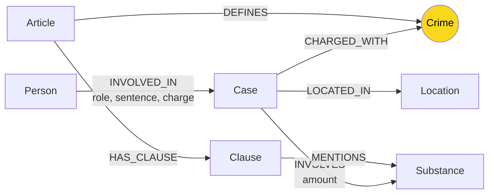

# Thiết kế Ontology — Day 19

**Họ tên:** Nguyễn Vũ Quang Anh  **MSSV:** 2A202602805  **Ngày:** 2026-10-06

**Lựa chọn:**
- [x] Dùng ontology gợi ý (có chỉnh sửa nhỏ ở truy vấn KG3)
- [ ] Tự thiết kế (xét bonus +15, xem `SUBMISSION.md`)

## 1. Sơ đồ

`Crime` là **node cầu nối**: tin tức đi từ `Case` qua `CHARGED_WITH` tới `Crime`, còn luật đi từ `Article` qua `DEFINES` tới cùng node đó.

## 2. Entity types (node labels)

| Label | Ý nghĩa | Khóa định danh (`MERGE` theo) | Properties | Lấy từ KB nào | Trích bằng |
| --- | --- | --- | --- | --- | --- |
| `Article` | Một điều luật | `id` | `id`, `title`, `law`, `doc_id` | Luật | Regex/front matter |
| `Clause` | Một khoản trong điều luật | `id` | `id`, `number`, `penalty`, `text`, `doc_id` | Luật | Regex |
| `Crime` | Tội danh chuẩn hóa | `name` | `name` | Cả hai | Tiêu đề luật + `link_entity` cho tin |
| `Substance` | Chất ma túy | `name` | `name` | Cả hai | Danh sách/regex ở luật, LLM ở tin |
| `Case` | Vụ việc được nêu trong một bài báo | `name` | `name`, `summary`, `date`, `doc_id`, `source_title` | Tin tức | LLM JSON |
| `Person` | Người tham gia vụ việc | `name` | `name`, `aliases` | Tin tức | LLM JSON |
| `Location` | Địa điểm của vụ việc | `name` | `name` | Tin tức | LLM JSON |

`Article`, `Clause`, và `Case` giữ `doc_id` của tài liệu nguồn để GraphRAG nối kết quả vector search với graph. `Crime`, `Substance`, `Person`, `Location` có thể là node dùng chung cho nhiều tài liệu nên không bắt buộc có một `doc_id` duy nhất.

## 3. Relationships

| Type | Từ → Đến | Properties trên cạnh | Ý nghĩa |
| --- | --- | --- | --- |
| `DEFINES` | `Article` → `Crime` | — | Điều luật định nghĩa tội danh |
| `HAS_CLAUSE` | `Article` → `Clause` | — | Điều luật gồm các khoản |
| `MENTIONS` | `Clause` → `Substance` | — | Khoản nêu chất ma túy hoặc ngưỡng liên quan |
| `CHARGED_WITH` | `Case` → `Crime` | — | Vụ việc bị truy tố/xét xử về tội danh |
| `INVOLVES` | `Case` → `Substance` | `amount` | Vụ việc có chất ma túy và khối lượng/số lượng nếu báo nêu |
| `LOCATED_IN` | `Case` → `Location` | — | Địa điểm chính của vụ việc |
| `INVOLVED_IN` | `Person` → `Case` | `role`, `sentence`, `charge` | Vai trò, mức án và tội danh riêng của người trong vụ |

## 4. Node cầu nối giữa 2 KB

- **Node nào:** `Crime`.
- **Vì sao chọn node này:** Tội danh là khái niệm chung có trong luật và tin tức. Từ vụ án, có thể đi `Case → Crime ← Article` để lấy Điều luật; đường đi ngắn, rõ nghĩa và đủ cho câu hỏi xuyên hai KB.
- **Cách đảm bảo hai phía khớp tên:** Tội danh chuẩn lấy từ tiêu đề Điều luật và được chuẩn hóa bởi `normalize_crime` (chữ thường, bỏ tiền tố “Tội”, gộp khoảng trắng). `link_entity` khớp chính xác trước, sau đó fuzzy match với ngưỡng 0.8; graph luôn `MERGE` node `Crime` theo tên chuẩn.
- **Khi nào cầu gãy, và xử lý:** Cầu gãy nếu bài báo không nêu tội danh, LLM trả JSON sai, hoặc tội ngoài phạm vi corpus luật. Hệ thống không nối đoán bừa khi `link_entity` không đủ tin cậy; khi đó cần bổ sung điều luật/danh sách tội danh, cải thiện prompt trích xuất, hoặc gắn cờ `unlinked_charge` để rà soát thủ công.

## 5. Competency questions

| Câu | Đường đi (Cypher pattern) | Trả lời được? |
| --- | --- | --- |
| Q1 | `(:Article)-[:HAS_CLAUSE]->(:Clause)` với Điều 2 Luật PCMT | Có; lấy định nghĩa tiền chất trong khoản tương ứng. |
| Q2 | `(:Person)-[r:INVOLVED_IN]->(:Case)` | Có; tên và `r.sentence` cho biết người nhận án tử hình. |
| Q3 | `(:Person)-[:INVOLVED_IN]->(:Case)-[:CHARGED_WITH]->(:Crime)<-[:DEFINES]-(:Article)-[:HAS_CLAUSE]->(:Clause {number: 1})` | Có; nối Lê Minh Thành với Điều 251 và khung cơ bản. |
| Q4 | `(:Person)-[:INVOLVED_IN]->(:Case)-[:CHARGED_WITH]->(:Crime)<-[:DEFINES]-(:Article)-[:HAS_CLAUSE]->(:Clause {number: 4})` | Có ở mức graph; Điều 255 khoản 4 có khung cao nhất. Benchmark cho thấy KG3 hiện có thể bỏ sót khoản này trong prompt. |
| Q5 | `(:Person)-[:INVOLVED_IN]->(:Case)-[:INVOLVES]->(:Substance)` và `(:Case)-[:CHARGED_WITH]->(:Crime)<-[:DEFINES]-(:Article)-[:HAS_CLAUSE]->(:Clause {number: 4})` | Có; Cái Quang Huy nối tới MDMA/Ketamine và Điều 250 khoản 4. |
| Q6 | `(:Case)-[:INVOLVES]->(:Substance {name: 'MDMA'})` | Có; trả danh sách các vụ liên quan MDMA; có thể nối thêm `Person` khi cần nêu người. |

## 6. Quyết định thiết kế và đánh đổi

1. **Dùng `Crime` chuẩn hóa làm cầu nối thay vì nối trực tiếp `Case` với `Article`.** Phương án trực tiếp đơn giản hơn nhưng lặp quan hệ và không biểu diễn tội danh như một thực thể dùng chung. Đổi lại, cầu `Crime` phụ thuộc chất lượng trích xuất/chuẩn hóa tội danh.
2. **Tách `Clause` khỏi `Article`.** Phương án một node `Article` chứa toàn văn ngắn hơn, nhưng không truy vấn được riêng khoản 1/khoản 4 và không thể nối từng khoản tới `Substance`. Tách khoản tạo nhiều node/cạnh hơn nhưng cho phép retrieval mức phạt chính xác hơn.
3. **Giữ `amount` trên quan hệ `INVOLVES`.** Khối lượng là đặc tính của một chất trong một vụ, không phải của `Substance` chung. Cách này tránh nhầm nhiều khối lượng MDMA giữa các vụ; đổi lại chuỗi như “hơn 9,6kg” chưa được chuẩn hóa số/đơn vị để so ngưỡng luật tự động.
4. **Dùng LLM cho tin tức, regex cho luật.** Văn bản luật đều cấu trúc nên regex rẻ và ổn định; tin tức đa dạng nên cần LLM trích xuất. Đánh đổi là LLM có thể bỏ trường hoặc tạo Case/Person trùng tên.

## 7. So với ontology gợi ý

Không áp dụng: bài này sử dụng ontology gợi ý, không yêu cầu bonus tự thiết kế.

## 8. Hạn chế còn lại

- `Case` và `Person` được `MERGE` theo tên do LLM sinh/nhận diện, nên cùng một thực thể có thể bị tách thành nhiều node khi cách viết khác nhau.
- `Substance` chưa chuẩn hóa đồng nghĩa (ví dụ tên lóng hoặc cách viết khác của cùng chất).
- Ngưỡng khối lượng trong `Clause.text` chưa được tách thành dữ liệu số có cấu trúc; KG3 chủ yếu lọc theo chất, nên có thể đưa thiếu hoặc thừa khoản.
- Graph không mô hình hóa rõ các giai đoạn tố tụng như bắt giữ, truy tố, xét xử và phúc thẩm.
- LLM trả lời cuối vẫn có thể nhầm số Điều với dữ kiện graph; lỗi Q5 trong benchmark là một ví dụ.
